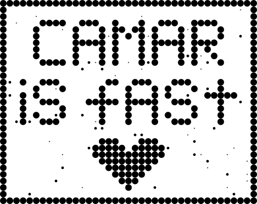

<p align="center">

</p>

# 🦟 CAMAR
CAMAR (Continuous Action Multi-Agent Routing) Benchmark is a fast, GPU-accelerated environment for multi-agent navigation and collision avoidance tasks in continuous state and action spaces. Designed to bridge the gap between multi-robot systems and MARL research, CAMAR emphasizes efficient simulation speeds (exceeding 100K+ Steps Per Second) and evaluation protocols to evaluate agent navigation capabilities.

---

## Installation

Camar can be installed from PyPi:

```bash
pip install camar
```

By default the installation includes a CPU-only version of JAX, to install a CUDA version:

```bash
pip install camar[cuda12]
```
or

```bash
pip install jax[cuda12] camar
```

If you want another version of JAX (i.e. TPU), you will need to install it separately, following the [JAX documentaion](https://docs.jax.dev/en/latest/installation.html).

Additionally, there are several options you may want to install:
```bash
# To use CAMAR as a TorchRL environment
pip install camar[torchrl]

# To enable matplotlib visualisation
pip install camar[matplotlib]

# To use LabMaze maps
pip install camar[labmaze]

# To train baselines
pip install camar[baselines]
```

---

## Quickstart

Camar follows the gymnax interface:
```python
import jax
from camar import camar_v0


key = jax.random.key(0)
key, key_r, key_a, key_s = jax.random.split(key, 4)

# Create environment
env = camar_v0()

# Reset environment
obs, state = env.reset(key_r)

# Sample random actions
actions = env.action_spaces.sample(key_a)

# Step environment
obs, state, reward, done, info = env.step(key_s, state, actions)
```

### Various maps
Default map is `RandomGrid` with random positions of obstacles, agents and goals on every `env.reset`, but there are several various maps. All of them can be imported from `camar.maps`. Here is an example:
```python
from camar.maps import StringGrid, RandomGrid, LabMaze
from camar import camar_v0


map_str = """
.....#.....
.....#.....
...........
.....#.....
.....#.....
#.####.....
.....###.##
.....#.....
.....#.....
...........
.....#.....
"""

string_grid_map = StringGrid(map_str, num_agents=8)

random_grid_map = RandomGrid()
labmaze_map = LabMaze(height=20, width=20, num_agents=10, random_seed=911) # TODO

env = camar_v0(string_grid_map)
obs, state, done = env.reset(jax.random.key(0))
```

Camar currently supports the following list of maps:
| Map Name     | Parameters                                                                                                                                                                                                                                                                                                                                                                                                                                  | Environment                                                           |
| ------------ | ------------------------------------------------------------------------------------------------------------------------------------------------------------------------------------------------------------------------------------------------------------------------------------------------------------------------------------------------------------------------------------------------------------------------------------------- | --------------------------------------------------------------------- |
| `RandomGrid` | `num_rows: int = 20` - number of rows.<br>`num_cols: int = 20` - number of columns.<br>`obstacle_density: float = 0.2` - obstacle density.<br>`num_agents: int = 32` - number of agents.<br>`obstacle_size: float = 0.4` - size of each obstacle.<br>`grain_factor: int = 6` - number of circles per obstacle edge.                                                              |  |
| `StringGrid` | `map_str : str` - string layout of a grid map. `.` is a free cell, otherwise it is an obstacle. <br>`num_agents: int = 10` - number of agents.<br>`obstacle_size: float = 0.1` - size of each circle obstacle.<br>`agent_size: float = 0.09` - size of each agent.<br>`remove_border: bool = False` - flag whether borders should be deleted or not.<br>`add_border: bool = True` - flag whether additional borders should be added or not. |    |
|              |                                                                                                                                                                                                                                                                                                                                                                                                                                             |                                                                       |
|              |                                                                                                                                                                                                                                                                                                                                                                                                                                             |                                                                       |


